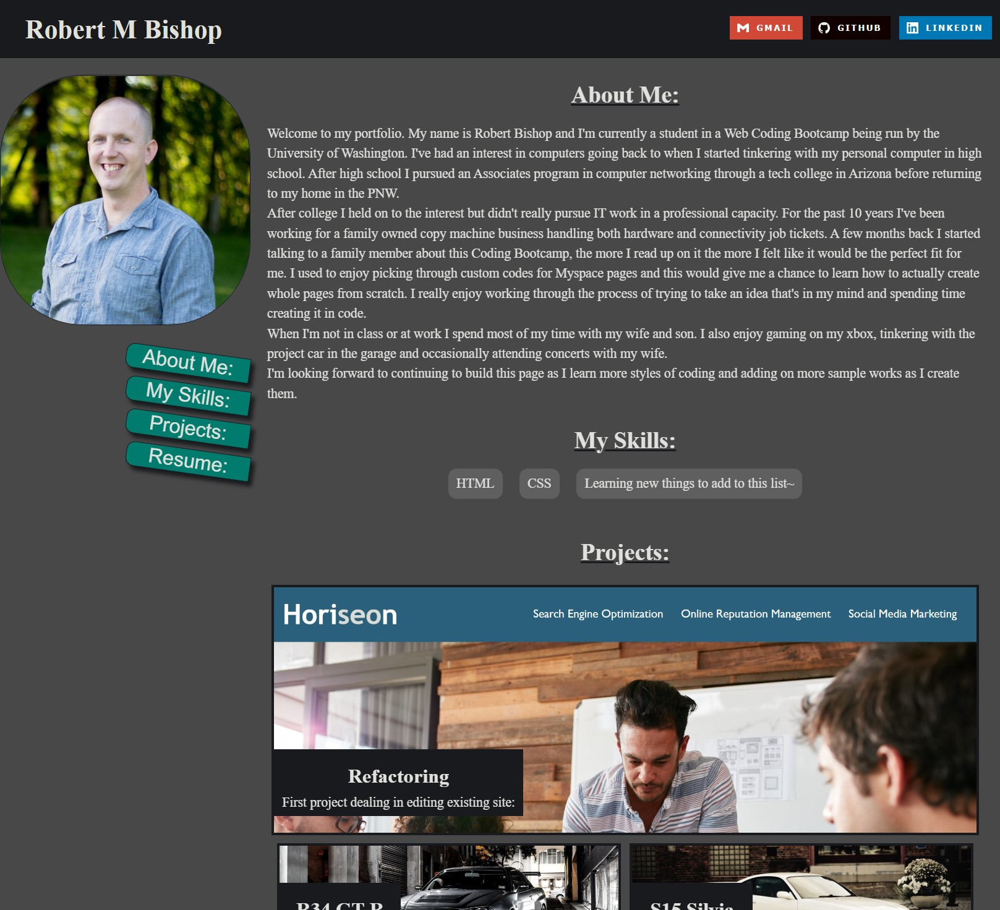
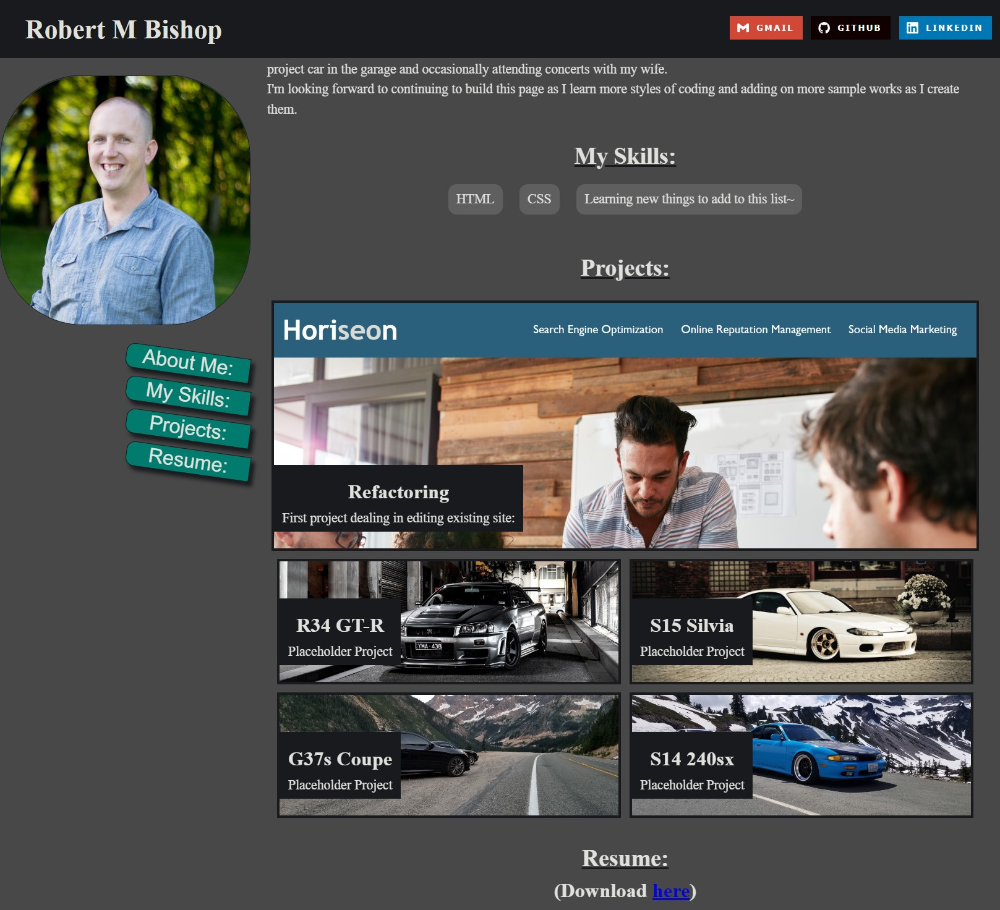
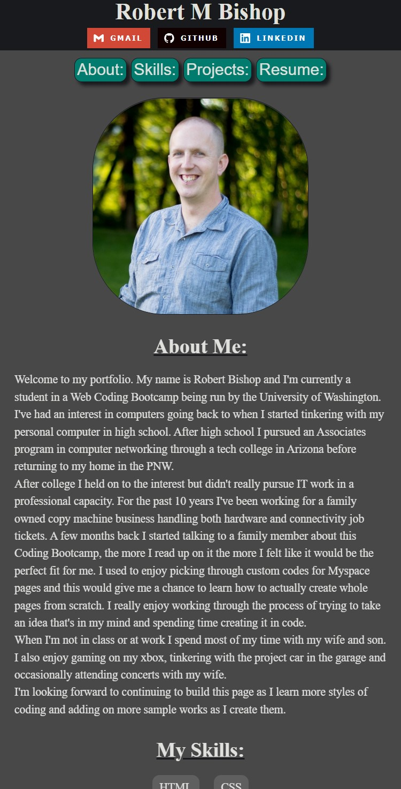
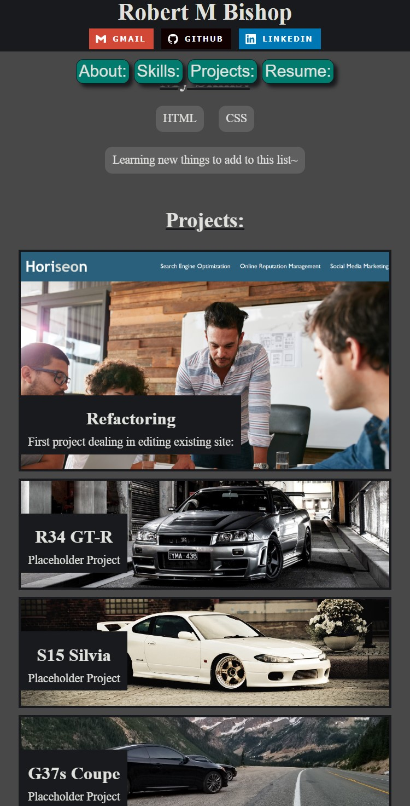

# **My Portfolio**

This is my personal portfolio page that allows me both to show off my skills in designing a page, as well as linking to various other works I've created.  This page will be updated overtime as I learn new skills and create new things that I wish to share.

---

## Contents:
* [Live Page Link](#live-page-link)
* [Version](#version-10)
* [Screenshots](#screenshots)
* [Skills/Concepts Used](#skillsconcepts-used)
* [Future Plans](#future-plans)
* [Credits](#credits)

---

## Live Page Link:

[https://rbishop85.github.io/myportfolio/](https://rbishop85.github.io/myportfolio/)

---

## Version: 1.0

Revision History:
* 1.0 - Initial page build

---

## Screenshots:

> **Note**: First two screenshots are in desktop mode, photo and navigation links on the left side.  Second set of screenshots are in phone mode, everything is stacked vertically.

---

## Skills/Concepts Used:
* HTML
* CSS
* Semantics
* Accessibility

---

## Future Plans:

* Better/more samples of work
* Add an actual resume, possibly created in code to be shown directly on page
* Update page design/layout to utilize more skills learned

---

## Credits:

* Contact Link Badges: https://github.com/alexandresanlim/Badges4-README.md-Profile
* First 2 Car Photos: https://wallpaperaccess.com/

---

[Top of Page](#my-portfolio)
